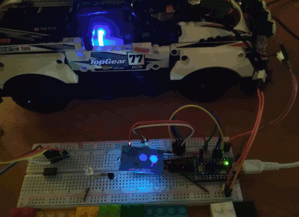
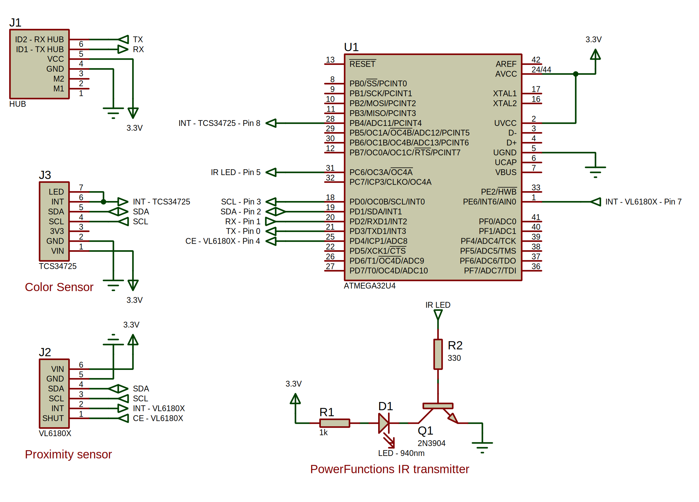
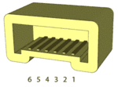
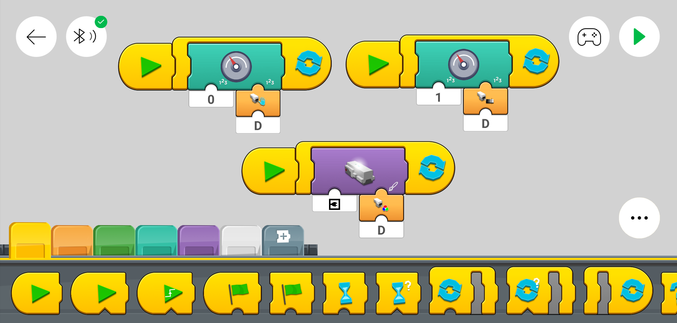
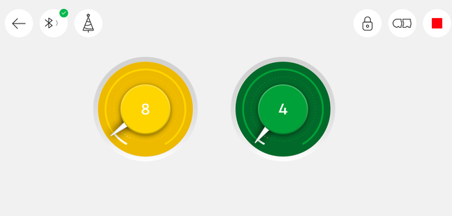
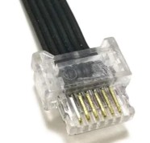
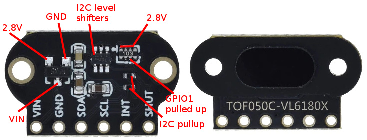
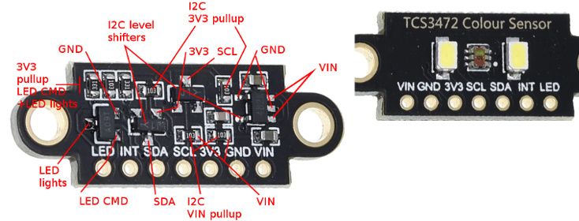

[](https://github.com/ysard/MyOwnBricks/releases/latest/)
[](https://www.ardu-badge.com/MyOwnBricks)
[](https://interrogate.readthedocs.io/en/latest/)
[](https://docs.pytest.org/en/latest/)

*English version ([See at the end for the French version](#table-des-matières))*

# Table of contents

* [MyOwnBricks](#myownbricks)
* [Supported Programmable Bricks &amp; Hubs](#supported-programmable-bricks--hubs)
* [Which microcontroller ?](#which-microcontroller-)
* [Usage](#usage)
    * [Examples](#examples)
    * [Connections](#connections)
    * [Code blocks](#code-blocks)
    * [Arduino code](#arduino-code)
* [Hardware](#hardware)
    * [Hub connection](#hub-connection)
    * [Distance sensor](#distance-sensor)
    * [Color sensor](#color-sensor)
    * [Infrared emitter](#infrared-emitter)
* [Development](#development)
    * [Cloning &amp; installation](#cloning--installation)
    * [Debugging packets - (Python library, devtools)](#debugging-packets---python-library-devtools)
    * [How to participate ?](#how-to-participate-)
* [MyOwnBricks is free AND open source](#myownbricks-is-free-and-open-source)
* [Credits](#credits)


# MyOwnBricks

MyOwnBricks is a library for building your own sensors and devices compatible with the
modern LEGO PoweredUp system.

MyOwnBricks is developed in C++ and can be run on ESP and Arduino platforms.
This project makes accessible (within the limits of the current Lego API and its application)
electronic prototyping from the LEGO ecosystem.

Using your own sensors you can reproduce LEGO sensors while improving/modifying
some of their characteristics (range, measurement accuracy, detection of more colors, etc.).

Improving sensors like the Color & Distance Sensor also opens the way to many
actions controlled from the official application, in response for example, to a request of
color change: activation of robots, trains, mechanisms, sensors, OLED/LCD displays,
switches or colored headlights.

This project is compatible with the alternative firmware project
[PyBricks (repository)](https://github.com/pybricks/pybricks-micropython)
([official website](https://pybricks.com/))
with which you can create new sensors from scratch if you want, without being limited
by the API of existing sensors.

As an alternative to PyBricks, using an ESP32 platform you will find the
[Legoino](https://github.com/corneliusmunz/legoino/) project.


# Supported Programmable Bricks & Hubs

Currently all PoweredUp hubs are compatible:

* LEGO Technic Hub 88012
* LEGO BOOST Move Hub 88006
* LEGO City Hub 88009
* LEGO Technic Large Hub - SPIKE Prime 45601
* LEGO Technic Small Hub - SPIKE Essential 45609
* [Raspberry Pi Build HAT](https://www.raspberrypi.com/news/raspberry-pi-build-hat-lego-education/)
(A programmable Technic Hub for 25$)

The following sensors are implemented:

* LEGO SPIKE Prime Color Sensor 45605
* LEGO Color & Distance Sensor 88007
* LEGO Tilt Sensor 45305


# Which microcontroller ?

Any MCU (ESP, Arduino).

It should be noted that the Hub works with a voltage of 3.3V which can be limiting in the
choice of hardware.

The development was done on an [Arduino Pro-Micro](https://www.sparkfun.com/products/12640)
based on Atmega32u4; it has 2 serial ports.
This allows to dedicate the USB serial port to firmware debugging, while letting the mcu
interact with the sensors on another port.
This experimental board can run at 16MHz on 3.3V (even if out of specification).

Note: Some "unofficial" copies may have voltage regulators that do not deliver exactly
exactly 3.3V. **Check voltages before connecting something to the Hub not powered by itself**.


# Usage

Demo of a color sensor whose detected color is displayed on the Technic hub.



## Examples

Examples of sketches are provided with a documentation to quickly start with the tested
sensors.
You can find the different examples in the "examples" folder of the project, or from the
Arduino IDE via the menu "File/Examples/MyOwnBricks" menu.

- **[color_distance_sensor](./examples/color_distance_sensor/)**:
Complete implementation of the official Color & Distance
sensor using a TCS34725 color sensor and a VL6180X distance sensor.
- **[color_sensor](./examples/color_sensor/)**: Implementation of the color sensor only.
- **[distance_sensor](./examples/distance_sensor/)**: Distance sensor implementation only.
- **[IR_emitter](./examples/IR_emitter/)**: Implementation of an infrared transmitter
for PowerFunctions modules.
The use of a callback receiving the code sent from the the Hub is provided.
- **[tilt_sensor](./examples/tilt_sensor/)**:
Skeleton for the implementation of the generic orientation sensor.
- **[Python Hub spoofing](./examples/python_hub_spoof/)**:
Concept proof of hub spoofing via a UART serial link;
it allows to easily debug a code implementing a sensor on the microcontroller side
without using an official hub.
- **[spike_color_sensor](./examples/spike_color_sensor/)**: Demonstration of emulation of
the SPIKE Prime Color Sensor 45605.

## Connections

Connections for the color and distance sensors as well as the infrared transmitter for
supporting PowerFunctions devices.



Reminder of the pinout of Wedo 2.0/PoweredUp connectors ([source](https://www.philohome.com/wedo2reverse/connect.htm)):



<table>
<tbody><tr>
    <td>Pin</td>
    <td>Label</td>
    <td>Function</td>
</tr>
<tr>
    <td>1</td>
    <td>M1</td>
    <td>Motor power lead 1 (PWM controlled)</td>
</tr>
<tr>
    <td>2</td>
    <td>M2</td>
    <td>Motor power lead 2 (PWM controlled)</td>
</tr>
<tr>
    <td>3</td>
    <td>GND</td>
    <td>Ground</td>
</tr>
<tr>
    <td>4</td>
    <td>VCC</td>
    <td>Power for device electronics (3.3V)</td>
</tr>
<tr>
    <td>5</td>
    <td>ID1</td>
    <td>Analog identification line 1 / Serial data (hub -&gt; device)</td>
</tr>
<tr>
    <td>6</td>
    <td>ID2</td>
    <td>Analog identification line 2 / Serial data (device -&gt; hub)</td>
</tr>
</tbody>
</table>

## Code blocks

Example of use of the Color & Distance Sensor in the PoweredUp application.
The distance and the quantity of reflected light are displayed on 2 separate meters.
The detected color is applied to the RGB LED of the Technic hub.




Note: Reference documentation of the programmable blocks (not official because LEGO
does not know how to document its informatics products...):
[racingbrick.com](https://racingbrick.com/powered-up-code-block-guide/)


## Arduino code

The basic code is as follows; declare a variable of type `ColorDistanceSensor` or
`TiltSensor` and then initialize it in the then initialize it in the `setup()` function.

Callbacks to receive notification of an IR code or a color change are also configured
in `setup()`.

The `loop()` function will eventually be used to update variables, and then process the
send/receive requests to the hub by calling the `process()` method of each object
proposed by `MyOwnBricks`.

```c++
#include "MyOwnBricks.h"

ColorDistanceSensor myDevice;
bool connection_status;

/**
* @brief Callback for IR code sent by the hub
*/
void IRCallback(const uint16_t value) {
    ...
}

void setup() {
    // Device config
    myDevice.setIRCallback(&IRCallback);
    connection_status = false;
}

void loop() {
    ...

    myDevice.process();
    if (myDevice.isConnected()) {
        // Already connected ?
        if (!connection_status) {
            Serial.println(F("Connected !"));
            connection_status = true;
        }
    } else {
        Serial.println(F("Not Connected !"));
        connection_status = false;
    }
}
```

Note: The loglevel of the lib can be adjusted by editing the file [`global.h`](./src/global.h).


# Hardware

## Hub connection

* 28AWG flexible silicone cable
* WEDO 2.0 connectors



Note: Buy them separately, pre-wired connectors cost an arm and a leg.

## Distance sensor



* VL6180X

    Time-of-flight telemetry sensor; laser technology
    Detection up to 20cm by default, can go up to 50cm at the expense of resolution.
    Modifiable i2c address
    Pins: shutdown, interrupt
    VIN: 3-5V
    VCC: 2.8V

## Color sensor



* TCS34725

    RGB sensor + clear channel
    Calculation of light intensity in lux
    IR filter
    i2C address NOT changeable
    Pins: LED, interrupt
    VIN: 3-5V
    VCC: 3.3V

**Note: For this sensor you should use my own version of the lib of Adafruit
(it still requires that the adafruit one to be installed).**
More details [here](https://github.com/ysard/TCS34725).


## Infrared emitter

* IR LED

    940nm
    3-5V, 30mA


# Development

To use different sensors, the examples provided will have to be adapted.
However, this work will essentially consist in converting the data of the new sensor
to the data expected by the LEGO application/Hub.
The MyOwnBricks library takes care of the communication protocol between the
experimentation board and the PoweredUp Hub.


To support a new PoweredUp sensor, it is first necessary to develop a new class
by inheriting from `BasicSensor` and taking inspiration from the classes and examples
already written.

This involves writing the various getters and setters to manage the specific attributes
and values of the sensor; then to implement the management of the commands coming from
the Hub and their answers in the function `handleModes()`.

The basic functions are already implemented so that you only have to write the code
specific to the new sensor.


## Cloning & installation

You can choose one of the following methods:

- Install the library via the Arduino IDE library manageror
- Download the zip file of the project and install it via the Arduino IDE:
`"Sketch/Include a library/Add a ZIP library"`.
- Contribute to the development by cloning the repository:
    `git clone https://github.com:ysard/MyOwnBricks.git`

## Debugging packets - (Python library, devtools)

An important part of the reverse engineering work relies on the use of a Python library
included in the repository in the [./my_own_bricks](./my_own_bricks) folder.

This library is used in particular in the example given to debug the implementation of a
sensor on a microcontroller without using the official Hub (Hub emulation).

Many functions are available to process the headers and the checksums of the packets.
As well as to process the data of some of them (analysis of the initialization sequence).

For more information, read the documents in the [./doc](./doc/) folder and the tests [./tests/](./tests/).

## How to participate ?

Any contribution to bring new examples, support new LEGO sensors and third party ones is
always welcome.

If you encounter problems or bugs, please open
an [issue](https://github.com/MyOwnBricks/issues). Thank you.


# MyOwnBricks is free AND open source

MyOwnBricks is released under the [GPL](https://www.gnu.org/licenses/gpl-3.0.html)
(GNU General Public License). You can read, test and modify its code.


# Credits

Thanks to @JorgePe and @philohome and their contributors for the reverse engenieering
part at https://github.com/JorgePe/BOOSTreveng
and https://www.philohome.com/wedo2reverse/connect.htm

Thanks to @ahmedjouirou for the first implementation https://github.com/ahmedjouirou/legopup_arduino

---
*Version française*

# Table des matières

* [MyOwnBricks](#myownbricks-1)
* [Hubs et capteurs officiels supportés](#hubs-et-capteurs-officiels-supportés)
* [Quel microcontrôleur ?](#quel-microcontrôleur-)
* [Usage](#usage-1)
    * [Exemples](#exemples)
    * [Branchements](#branchements)
    * [Code blocks](#code-blocks-1)
    * [Code Arduino](#code-arduino)
* [Matériel](#matériel)
    * [Connexion au hub](#connexion-au-hub)
    * [Capteur de distance](#capteur-de-distance)
    * [Capteur de couleur](#capteur-de-couleur)
    * [Emetteur infrarouge](#emetteur-infrarouge)
* [Développement](#développement)
    * [Clonage &amp; installation](#clonage--installation)
    * [Debugger les paquets - (Librairie Python, devtools)](#debugger-les-paquets---librairie-python-devtools)
    * [Comment participer ?](#comment-participer-)
* [MyOwnBricks est libre ET open source](#myownbricks-est-libre-et-open-source)
* [Crédits](#crédits)


# MyOwnBricks

MyOwnBricks est une librairie pour construire ses propres capteurs et périphériques
compatibles avec le système moderne LEGO PoweredUp.

MyOwnBricks est développé en C++ et peut être exécuté sur les plateformes ESP et Arduino.
Ce projet rend accessible (dans la limite de l'API Lego actuelle et de son application mobile)
le prototypage électronique depuis l'écosystème LEGO.


En utilisant vos propres capteurs vous pouvez reproduire les capteurs LEGO tout en
améliorant/modifiant certaines de leurs caractéristiques (portée, précision des mesures,
détection de plus de couleurs, etc.).

Le détournement de capteurs comme le Capteur de Couleur et de Distance ouvre également
la voie à de nombreuses actions commandées depuis l'application officielle en réponse
par exemple, à une demande de changement de couleur: l'activation de robots, trains,
mécanismes, capteurs, écran OLED/LCD, relais ou encore phares colorés.


Ce projet est compatible avec le projet de firmware alternatif
[PyBricks (dépôt)](https://github.com/pybricks/pybricks-micropython) ([site officiel](https://pybricks.com/))
avec lequel vous pourrez si vous le souhaitez créer de nouveaux capteurs de A à Z
sans être limité par l'API des capteurs existants.

En alternative à PyBricks, utilisant une plateforme ESP32 vous trouverez le projet
[Legoino](https://github.com/corneliusmunz/legoino/).


# Hubs et capteurs officiels supportés

Actuellement tous les hubs PoweredUp sont compatibles:

* LEGO Technic Hub 88012
* LEGO BOOST Move Hub 88006
* LEGO City Hub 88009
* LEGO Technic Large Hub - SPIKE Prime 45601
* LEGO Technic Small Hub - SPIKE Essential 45609
* [Raspberry Pi Build HAT](https://www.framboise314.fr/raspberry-pi-build-hat-pour-piloter-vos-projets-lego/)
(Un Hub Technic programmable pour 25€)

Les capteurs suivants sont implémentés:

* LEGO SPIKE Prime Color Sensor 45605
* LEGO Color & Distance Sensor 88007
* LEGO Tilt Sensor 45305


# Quel microcontrôleur ?

N'importe quel MCU (ESP, Arduino).

Il faut toutefois noter que le Hub fonctionne avec une tension de 3.3V ce qui peut être
limitant dans le choix du matériel.

Le développement a été fait sur un [Arduino Pro-Micro](https://www.sparkfun.com/products/12640)
basé sur Atmega32u4; il dispose de 2 ports série.
Cela permet de dédier le port série USB au débuggage du firmware, tout en laissant le mcu
interagir avec les capteurs sur un autre port.
Cette carte d'expérimentation peut fonctionner à 16MHz sur 3.3V (même si hors spécifications).

Note: Certaines copies "non officielles" peuvent disposer de régulateurs de tension qui ne
délivrent pas exactement
une tension de 3.3V. **Vérifiez les tensions avant toute connexion de quelque-chose au Hub
qui ne soit pas alimenté par lui.**


# Usage

Démo de fonctionnement d'un capteur de couleur dont la couleur détectée est affichée sur
le hub Technic.


## Exemples

Des exemples de sketchs sont fournis avec une documentation permettent de démarrer
rapidement avec les capteurs testés.
Vous trouverez les différents exemples dans le dossier "examples" du projet, ou depuis
l'IDE Arduino via le menu "File/Examples/MyOwnBricks".

- **[color_distance_sensor](./examples/color_distance_sensor/)**:
Implémentation complète du capteur Color & Distance
officiel utilisant le capteur de couleur TCS34725 et le capteur de distance VL6180X.
- **[color_sensor](./examples/color_sensor/)**: Implémentation seule du capteur de couleur.
- **[distance_sensor](./examples/distance_sensor/)**: Implémentation seule du capteur de distance.
- **[IR_emitter](./examples/IR_emitter/)**: Implémentation d'un transmetteur infrarouge pour
les modules PowerFunctions.
L'usage d'un callback recevant le code envoyé depuis le Hub y est démontré.
- **[tilt_sensor](./examples/tilt_sensor/)**:
Squelette pour l'implémentation du capteur d'orientation générique.
- **[Usurpation de Hub en Python](./examples/python_hub_spoof/)**:
Preuve de concept simulant un Hub au travers d'une liaison série (UART);
cet exemple est utile pour débugger l'implémentation d'un capteur sur un microcontrôleur
sans passer par le Hub officiel.
- **[spike_color_sensor](./examples/spike_color_sensor/)**: Demonstration de l'émulation du
capteur SPIKE Prime Color 45605.

## Branchements

Branchements des capteurs de couleur et de distance ainsi que de l'émetteur infrarouge
pour le support des périphériques PowerFunctions.


Rappel des branchements des connecteurs Wedo 2.0 / PoweredUp ([source](https://www.philohome.com/wedo2reverse/connect.htm)):


<table>
<tbody><tr>
    <td>Pin</td>
    <td>Label</td>
    <td>Function</td>
</tr>
<tr>
    <td>1</td>
    <td>M1</td>
    <td>Motor power lead 1 (PWM controlled)</td>
</tr>
<tr>
    <td>2</td>
    <td>M2</td>
    <td>Motor power lead 2 (PWM controlled)</td>
</tr>
<tr>
    <td>3</td>
    <td>GND</td>
    <td>Ground</td>
</tr>
<tr>
    <td>4</td>
    <td>VCC</td>
    <td>Power for device electronics (3.3V)</td>
</tr>
<tr>
    <td>5</td>
    <td>ID1</td>
    <td>Analog identification line 1 / Serial data (hub -&gt; device)</td>
</tr>
<tr>
    <td>6</td>
    <td>ID2</td>
    <td>Analog identification line 2 / Serial data (device -&gt; hub)</td>
</tr>
</tbody>
</table>

## Code blocks

Exemple d'usage du capteur de couleur & distance dans l'application PoweredUp.
La distance et la quantité de lumière réfléchie sont affichées sur 2 compteurs distincts.
La couleur détectée est répercutée sur la LED RGB du hub Technic.


Note: Documentation de référence des blocs programmables (non officielle car LEGO ne sait
pas documenter ses produits informatiques...):
[racingbrick.com](https://racingbrick.com/powered-up-code-block-guide/)


## Code Arduino

Le code de base est le suivant; déclarez une variable de type `ColorDistanceSensor` ou
`TiltSensor` puis initialisez-la dans la fonction `setup()`.

Les callbacks servant à être notifié de l'envoi d'un code IR ou d'un changement de couleur
sont aussi configurés dans `setup()`.

La fonction `loop()` servira éventuellement à mettre à jour les variables,
puis à traiter les requêtes envoi/réception au hub par l'appel
de la méthode `process()` de chaque objet proposé par `MyOwnBricks`.

```c++
#include "MyOwnBricks.h"

ColorDistanceSensor myDevice;
bool connection_status;

/**
* @brief Callback for IR code sent by the hub
*/
void IRCallback(const uint16_t value) {
    ...
}

void setup() {
    // Device config
    myDevice.setIRCallback(&IRCallback);
    connection_status = false;
}

void loop() {
    ...

    myDevice.process();
    if (myDevice.isConnected()) {
        // Already connected ?
        if (!connection_status) {
            Serial.println(F("Connected !"));
            connection_status = true;
        }
    } else {
        Serial.println(F("Not Connected !"));
        connection_status = false;
    }
}
```

Note: Le niveau de debuggage de la librairie peut être réglé en éditant le fichier
[`global.h`](./src/global.h).


# Matériel

## Connexion au hub

* Câble en silicone souple 28AWG
* Connecteurs WEDO 2.0


Note: Achetez-les séparément, les connecteurs pré-câblés coutent les yeux de la tête.

## Capteur de distance


* VL6180X

    Capteur de télémétrie temps de vol; technologie laser
    Détection jusqu'à 20cm par défaut, peut aller jusqu'à 50cm au détriment de la résolution.
    Adresse i2c modifiable
    Pins: shutdown, interrupt
    VIN: 3-5V
    VCC: 2.8V


## Capteur de couleur


* TCS34725

    Capteur RGB + canal clear
    Calcul de l'intensité lumineuse en lux
    Filtre IR
    Adresse i2C NON modifiable
    Pins: LED, interrupt
    VIN: 3-5V
    VCC: 3.3V

**Note: Pour ce capteur vous devriez utiliser ma propre version de la librairie
Adafruit (la librairie d'origine doit toujours être installée)**
Plus de détails [ici](https://github.com/ysard/TCS34725).

## Émetteur infrarouge

* LED IR

    940nm
    3-5V, 30mA


# Développement

Pour utiliser des capteurs différents il faudra adapter les exemples fournis.
Toutefois ce travail consistera essentiellement à convertir les données du nouveau capteur
vers les données attendues par l'application Lego.
La librairie MyOwnBricks s'occupe du protocole d'échange entre la carte d'expérimentation
et le Hub PoweredUp.


Pour supporter un nouveau capteur PoweredUp, il faut avant tout développer une nouvelle
classe en héritant de BasicSensor et en s'inspirant des classes et exemples déjà écrits.

Il s'agit de rédiger les divers getters et setters pour gérer les attributs et valeurs
propres au capteur; puis d'implémenter la gestion des commandes en provenance du Hub et
leurs réponses dans la fonction `handleModes()`.

Les fonctions de base sont déjà implémentées pour ne devoir écrire que le code spécifique
au nouveau capteur.

## Clonage & installation

Vous pouvez suivre une des méthodes suivantes :

- Installer la librairie depuis le gestionnaire de librairies de l'IDE Arduino
- Télécharger le fichier zip du projet et l'installer via l'IDE Arduino:
`"Croquis/Inclure une bibliothèque/Ajouter la bibliothèque .ZIP"`.
- Participer au développement en clonant le dépôt:
    `git clone https://github.com:ysard/MyOwnBricks.git`

## Debugger les paquets - (Librairie Python, devtools)

Une part importante du travail de rétro-ingénierie repose sur l'usage d'une bibliothèque Python
incluse dans le dépôt dans le dossier [./my_own_bricks](./my_own_bricks).

Cette librairie est sert notament dans l'exemple donné pour débugger l'implémentation d'un
capteur sur un microcontrôleur sans passer par le Hub officiel (émulation de Hub).

De nombreuses fonctions sont disponibles pour traiter les en-têtes et checksums des paquets.
Ainsi que traiter les données de certains d'entre eux (analyse de la séquence d'initialisation).

Pour plus d'informations, lisez les documents dans le dossier [./doc](./doc/) et les tests [./tests/](./tests/).

## Comment participer ?

Toute contribution pour apporter de nouveaux exemples, supporter de nouveaux capteurs LEGO
et tierce partie est toujours bienvenue.

Si vous rencontrez des problèmes ou des bugs, veuillez ouvrir
une [issue](https://github.com/MyOwnBricks/issues). Merci.


# MyOwnBricks est libre ET open source

MyOwnBricks est publié sous licence [GPL](https://www.gnu.org/licenses/gpl-3.0.fr.html) (Licence publique générale GNU).
Vous pouvez lire, tester et modifier son code.


# Crédits

Merci à @JorgePe et @philohome et leurs contributeurs pour la rétro ingénierie sur https://github.com/JorgePe/BOOSTreveng
et https://www.philohome.com/wedo2reverse/connect.htm

Merci à @ahmedjouirou pour la première implémentation  https://github.com/ahmedjouirou/legopup_arduino
